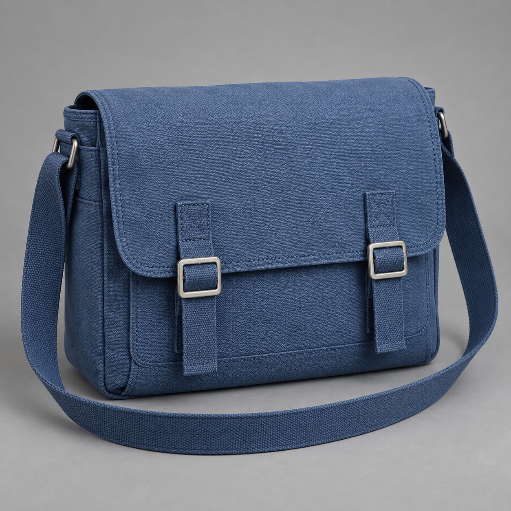

# Awesome MiniMax H3 Guide · Flyne AI


<sub>AI-generated editorial cover; not an H3 output.</sub>

[English](README.md) · [简体中文](README_zh.md) · [日本語](README_ja.md) · [한국어](README_ko.md) · [Español](README_es.md) · [Français](README_fr.md) · [Deutsch](README_de.md) · [Português](README_pt.md)

A practical, source-backed library for making useful audiovisual clips with MiniMax H3: **100 prompts, production workflows, model selection and an evaluation protocol**. Published by [Flyne AI](https://flyne.ai/).

**84 prompts are attributed MIT-licensed imports; 16 are new Flyne AI recipes.** This is an independent community project. No recipe has been independently tested by this project; there are no generated-output or benchmark claims.

[Browse 100 prompts](prompts/README.md) · [Try H3 on Flyne AI](https://flyne.ai/model/minimax-h3/) · [H3 vs H3 Max](docs/model-guide.md) · [Sources](docs/sources.md)

[Five-second quick start](docs/quick-start.md) · [Reference images](docs/reference-gallery.md) · [Prompting guide](docs/prompting-guide.md) · [12 templates](templates/README.md) · [Deployment](docs/deployment-guide.md) · [Migration audit](docs/migration-audit.md)

## Try MiniMax H3 on Flyne AI

| Recommended browser access | Free trial — no sign-up |
|---|---|
| [MiniMax H3](https://flyne.ai/model/minimax-h3/) | [Start with a quick online experiment](https://flyne.ai/free-minimax-h3/) |

The free interface inspected on 2026-09-21 offers **5-second, 480p** clips. Use the [five-second exercises](docs/quick-start.md); the longer X examples may require different settings and inputs.

## Start with one usable shot

1. Pick a delivery problem from the table below.
2. Read the recipe's reference map. Use only inputs accepted by your selected interface.
3. Adapt the timing to its available duration. Start with one subject and one action.
4. Generate, inspect and fix one failure type at a time.
5. Save a [run record](templates/run-record.json); approve against the [quality rubric](docs/evaluation.md).

Quick text-only idea, FY-001 (conceptual):

```text
A five-second vertical shot of an unbranded coral desk lamp on a slate desk.
One finger presses its single button; a warm pool of light appears on a blank
notebook. The hand leaves and the lamp holds still. Fixed camera, soft daylight,
stable geometry, no captions or logos. The action must be clear with sound off.
```

[Full recipe, acceptance criteria and recovery](prompts/flyne/fy-001.md). Duration and aspect ratio are creative targets, not guaranteed API options.

## Watch creator videos and study the prompts

12 X examples: video previews, original posts, short prompt excerpts and practical notes. The 6 selected examples appear below. Each of the 12 entries now includes a separate, copy-ready five-second Flyne exercise (untested).

[全部案例 / All examples](docs/x-community-showcase.md) · [官方示例 / Official examples](docs/official-h3-examples.md)

| Beat-synced western title sequence / 踩点西部动画片头 | Cyber-grunge music-video texture / 赛博杂志风音乐短片 | Bangkok street-food travel vlog / 曼谷街头美食短片 |
|---|---|---|
| [](https://x.com/doctorwasif/status/2085599659326935100/video/1) | [](https://x.com/Just_sharon7/status/2082711476347998615/video/1) | [](https://x.com/nawalsehar/status/2085233880353915217/video/1) |
| [@doctorwasif · Post / 原帖](https://x.com/doctorwasif/status/2085599659326935100) · [MP4](https://video.twimg.com/amplify_video/2085599599801077760/vid/avc1/1920x1080/aQ8Mx5ImZmjNxrZR.mp4?tag=29) | [@Just_sharon7 · Post / 原帖](https://x.com/Just_sharon7/status/2082711476347998615) · [MP4](https://video.twimg.com/amplify_video/2082710677236703232/vid/avc1/2560x1440/yMtktSF0xjjMkSvB.mp4?tag=29) | [@nawalsehar · Post / 原帖](https://x.com/nawalsehar/status/2085233880353915217) · [MP4](https://video.twimg.com/amplify_video/2085233539185061888/vid/avc1/2560x1440/jgQLrvA-NHvBJBx_.mp4?tag=29) |

| Reference-guided Barcelona drone route / 参考图引导航拍路线 | Mirror-side skincare demonstration / 镜前护肤演示 | Seaside morning with a delayed selfie reveal / 海边晨间短片：延后自拍开场 |
|---|---|---|
| [](https://x.com/Diplomeme/status/2083056488122380671/video/1) | [](https://x.com/ZaraIrahh/status/2083011066800242986/video/1) | [](https://x.com/ayzalnooor24521/status/2086671141998059973/video/1) |
| [@Diplomeme · Post / 原帖](https://x.com/Diplomeme/status/2083056488122380671) · [MP4](https://video.twimg.com/amplify_video/2083056439854309376/vid/avc1/1078x1288/s-5o20hibEjMgXgq.mp4?tag=29) | [@ZaraIrahh · Post / 原帖](https://x.com/ZaraIrahh/status/2083011066800242986) · [MP4](https://video.twimg.com/amplify_video/2083010639748882432/vid/avc1/2560x1440/aZjO-LgvvLJfiCUF.mp4?tag=29) | [@ayzalnooor24521 · Post / 原帖](https://x.com/ayzalnooor24521/status/2086671141998059973) · [MP4](https://video.twimg.com/amplify_video/2086670800896266240/vid/avc1/1088x720/cuQvyUS43S25Vss3.mp4?tag=29) |


XH3-008 publishes a partial prompt. Videos belong to their creators and were not regenerated by Flyne AI; external media are outside this repository’s MIT license.

## Official examples / 官方示例

Official MiniMax previews, linked to their original skills; not FlyneAI outputs. / MiniMax 官方预览，链接到原始教程，不是 FlyneAI 生成结果。

| Product / 产品 | Animation / 动画 | Music / 音乐 |
|---|---|---|
| [](https://github.com/MiniMax-AI/MiniMax-H3/tree/main/skills/minimalist-product-ad-generator) | [](https://github.com/MiniMax-AI/MiniMax-H3/tree/main/skills/3d-animation-short-generator) | [](https://github.com/MiniMax-AI/MiniMax-H3/tree/main/skills/mv-subtitle-skill-confirmed) |

[Official source gallery / 完整官方案例](docs/official-h3-examples.md)

## Reference images for your next shot

Three Flyne AI illustrations plus eleven attributed reference stills, linked to recipes and image briefs. These are not H3 outputs.

| FY-001 台灯 / Lamp | FY-002 包款 / Bag | FY-009 字幕背景 / Backdrop |
|---|---|---|
| [](prompts/flyne/fy-001.md) | [](prompts/flyne/fy-002.md) | [](prompts/flyne/fy-009.md) |

AI-generated reference stills; not H3 outputs. / AI 生成参考图，不是 H3 视频结果。[使用说明 / Usage notes](assets/flyne-reference-briefs.md)

| Product / 产品 | Character / 角色 | Travel / 旅行 |
|---|---|---|
| [](docs/reference-gallery.md) | [](docs/reference-gallery.md) | [](docs/reference-gallery.md) |

[全部参考图 / All reference images](docs/reference-gallery.md)

## Choose a production problem

| Goal | Start here | Main acceptance check |
|---|---|---|
| Advertising and social hooks | [Brand library](prompts/upstream/01-brand-advertising.md), [silent hook](prompts/flyne/fy-001.md) | Clear action, no unsupported claims |
| Product and SKU variants | [Commerce library](prompts/upstream/02-product-ecommerce.md), [colorway comparison](prompts/flyne/fy-002.md) | Product geometry and materials |
| Customer support and training | [Latch demo](prompts/flyne/fy-003.md), [warehouse exceptions](prompts/flyne/fy-010.md) | Expert-verified procedure |
| Software and onboarding | [UI library](prompts/upstream/11-ui-game-digital.md), [empty state](prompts/flyne/fy-005.md) | Correct interface state |
| Localization and character | [Dialogue library](prompts/upstream/21-character-dialogue-performance.md), [bilingual greeting](prompts/flyne/fy-006.md) | Meaning, identity and timing |
| Interactive previsualization | [Museum branch](prompts/flyne/fy-007.md), [weather alternative](prompts/flyne/fy-015.md) | Consistent opening/closing state |
| Design and editorial motion | [Packaging](prompts/flyne/fy-008.md), [caption-safe backdrop](prompts/flyne/fy-009.md) | Feasibility and readability |
| Controlled edits and diagnostics | [Seasonal display](prompts/flyne/fy-012.md), [reference stress test](prompts/flyne/fy-016.md) | Changes stay within scope |

The imported collection also covers travel, food, fashion, cinema, animation, sports, VFX, music, education, architecture, mobility, pets, industry and vertical series. [Complete catalog](prompts/README.md) · [Use conditions](docs/recipe-usage.md).

## H3 is not the same release as H3 Max

As checked on **2026-09-17**, H3-Base has downloadable FL2VA and Ref2VA weights. H3 Max is fal's hosted post-trained derivative; no public Max weights were found in the checked primary sources. The official full 2K workflow also includes hosted components. [Model guide and citations](docs/model-guide.md).

This repository's MIT license does not license model weights or grant service access. Read the current H3 Community License and the terms of your chosen route. Never assume a community quantization is Max or that a future release has already happened.

## Workflows and longer-term value

- [Browser, local and hosted workflows](docs/workflows.md): route selection, reference roles and multi-shot handoff.
- [Evaluation and cost](docs/evaluation.md): accepted-output rate, cost per usable clip and review criteria.
- [Ecosystem opportunities](docs/opportunities.md): reference libraries, localization, adaptation and optimization experiments.
- [Source register](docs/sources.md): primary links, review date and unresolved questions.
- [Roadmap](ROADMAP.md): what the community can verify and improve next.

Open weights can support adaptation and independent measurement. The practical asset is a repeatable workflow with evidence, not a larger untested prompt count. Opportunities in this guide are hypotheses to test, not promised commercial results.

## Offline search and maintenance

Requires Python 3.9+; no third-party packages or API keys.

```sh
python3 scripts/catalog.py search "product"
python3 scripts/catalog.py search "FX5-002" --origin exercise --show-prompt
python3 scripts/catalog.py search "客服" --origin flyne --show-prompt
python3 scripts/build.py
python3 scripts/validate.py
```

Search covers 100 recipes plus 12 separate five-second exercises. Use `--origin exercise` to filter exercises and `--show-prompt` to print both languages. Exercises remain untested and are distinct from the creator prompts.

[data/catalog.json](data/catalog.json) is machine-readable. Validation checks counts, unique IDs, local links, language pages and prompt provenance; it does not run a video model. Eight README languages are provided; detailed guides are English with Chinese summaries, and canonical prompts are English.

## Flyne AI, attribution and contributions

[Flyne AI](https://flyne.ai/) is the project brand and browser workflow entry. Access, credits and supported modes follow the current product page; this repository does not promise permanent free generation or a Flyne H3 Max endpoint.

The 84 imported recipes remain credited to **Flaq AI**, pinned to a source commit, with unchanged prompt blocks and the complete original MIT license. New Flyne material is separately identified. [Attribution and import history](THIRD_PARTY_NOTICES.md).

Contribute a reproducible test, a new production scenario, a translation correction or an official-source update. See [CONTRIBUTING.md](CONTRIBUTING.md), [prompt template](templates/prompt.md) and [conduct](CODE_OF_CONDUCT.md).

[MIT](LICENSE) for Flyne additions · [upstream MIT](licenses/Flaq-AI-MIT.txt) for imported content. Independent of MiniMax; product names belong to their owners.

## Become a Flyne AI affiliate partner

We welcome creators, educators, reviewers and creative teams to become our partners! Share Flyne AI through your referral link and earn commission on eligible paid orders:

- **20%** on a referred user's first valid paid order.
- **10%** on subsequent valid paid orders placed within **60 days of that user's registration**.

[Join the Flyne AI Affiliate Program](https://flyne.ai/affiliate-program/). Commission eligibility, attribution and payouts follow the current program agreement and review process.

Questions or partnership enquiries? Contact us at [contact@flyne.ai](mailto:contact@flyne.ai).
