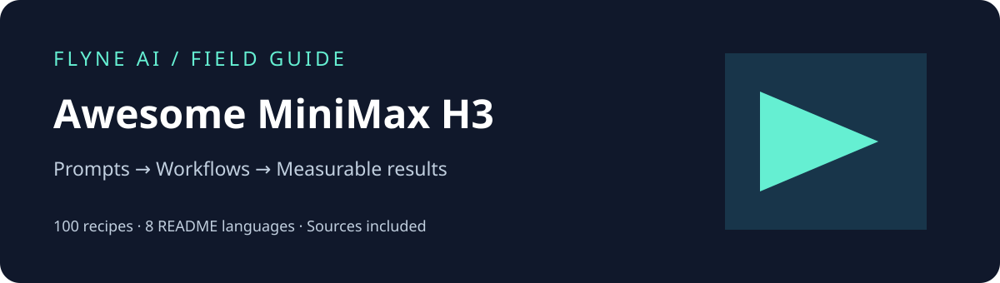

# Awesome MiniMax H3 Guide · Flyne AI



[English](README.md) · [简体中文](README_zh.md) · [日本語](README_ja.md) · [한국어](README_ko.md) · [Español](README_es.md) · [Français](README_fr.md) · [Deutsch](README_de.md) · [Português](README_pt.md)

## Praxisleitfaden für audiovisuelle Produktion mit MiniMax H3

Eine Community-Ressource von Flyne AI mit 100 Prompts, Produktionsabläufen, Modellauswahl sowie Qualitäts- und Kostenbewertung. 84 Rezepte werden unter MIT mit Quellenangabe übernommen; 16 sind neue Vorschläge von Flyne AI. Dieses Projekt hat ihre Ergebnisse nicht durch Generierung überprüft.

[Alle Prompts](prompts/README.md) · [Bei Flyne AI ausprobieren](https://flyne.ai/model/minimax-h3/) · [Modellleitfaden](docs/model-guide.md)

## Erste Schritte

Wähle ein Rezept passend zum Ergebnis und lege die Rolle jeder Referenz fest. Verwende nur Eingaben, die deine Oberfläche unterstützt. Beginne mit einem Motiv und einer Handlung. Prüfe Form, Bewegung und Ton, korrigiere jeweils eine Fehlerart und dokumentiere den Lauf.

[Run record](templates/run-record.json) · [Prompt template](templates/prompt.md)

## Anwendungsfälle

| ID | Anwendungsfälle |
|---|---|
| FY-002 | [Produktvarianten](prompts/flyne/fy-002.md) |
| FY-003 | [Kundensupport](prompts/flyne/fy-003.md) |
| FY-006 | [Lokalisierung](prompts/flyne/fy-006.md) |
| FY-009 | [Untertitel-Hintergründe](prompts/flyne/fy-009.md) |
| FY-016 | [Referenzprüfung](prompts/flyne/fy-016.md) |

## Modelle und Verfügbarkeit

Stand 2026-09-17: H3-Base bietet herunterladbare Gewichte. H3 Max ist eine von fal nachtrainierte, gehostete Variante; in den geprüften Primärquellen wurden keine öffentlichen Gewichte gefunden. Auch der vollständige offizielle 2K-Ablauf enthält gehostete Komponenten. Die MIT-Lizenz des Repositories ist nicht die Community License des Modells.

[Modellleitfaden](docs/model-guide.md) · [Quellen](docs/sources.md)

## Dokumentation und Suche

- [Produktionsabläufe](docs/workflows.md)
- [Qualität und Kosten](docs/evaluation.md)
- [Künftige Nutzungshypothesen](docs/opportunities.md)
- [Quellen](docs/sources.md)

Python 3.9+:

```sh
python3 scripts/catalog.py search "product"
python3 scripts/catalog.py search "FY-002" --show-prompt
python3 scripts/catalog.py build
python3 scripts/validate.py
```

[JSON catalog](data/catalog.json)

## Urheberschaft und Mitarbeit

Die 84 übernommenen Rezepte behalten den Copyright-Hinweis von Flaq AI und die ursprüngliche MIT-Lizenz. Leichtes Umformulieren wird nicht als eigene Urheberschaft ausgegeben. Neue Vorschläge sind ungetestet. README-Dateien gibt es in acht Sprachen; die ausführlichen Leitfäden sind Englisch mit chinesischen Zusammenfassungen, die maßgeblichen Prompts Englisch. Preise, Modi und Zugang richten sich nach der aktuellen Flyne-AI-Produktseite.

[Drittanbieterhinweise](THIRD_PARTY_NOTICES.md) · [Mitwirken](CONTRIBUTING.md) · [MIT](LICENSE) · [Flaq AI MIT](licenses/Flaq-AI-MIT.txt)

## Werde Affiliate-Partner von Flyne AI

Wir laden Kreative, Lehrende, Rezensenten und Produktionsteams ein, unsere Partner zu werden! Teile Flyne AI über deinen Empfehlungslink und erhalte Provisionen für berechtigte, gültige bezahlte Bestellungen:

- **20 %** für die erste gültige bezahlte Bestellung eines geworbenen Nutzers.
- **10 %** für weitere gültige bezahlte Bestellungen innerhalb von **60 Tagen nach dessen Registrierung**.

[Am Flyne AI Affiliate-Programm teilnehmen](https://flyne.ai/affiliate-program/). Berechtigung, Zuordnung und Auszahlung richten sich nach der aktuellen Vereinbarung und dem Prüfverfahren.

Fragen oder Interesse an einer Zusammenarbeit? Kontaktiere uns unter [contact@flyne.ai](mailto:contact@flyne.ai).
