# Awesome MiniMax H3 Guide · Flyne AI

[](assets/flyne-h3-cover.png)

<sub>封面为 AI 生成的展示配图，不是 H3 生成结果。</sub>

[English](README.md) · [简体中文](README_zh.md) · [日本語](README_ja.md) · [한국어](README_ko.md) · [Español](README_es.md) · [Français](README_fr.md) · [Deutsch](README_de.md) · [Português](README_pt.md)

面向实际交付的 MiniMax H3 音视频创作指南：**100 条提示词、模型选型、部署路线、质量与成本评估**，由 [Flyne AI](https://flyne.ai/) 品牌发布。

**84 条为注明来源的 MIT 授权引入内容，16 条为 Flyne AI 新增方案。** 本项目为独立社区资源，所有提示词均尚未由本项目独立实测，不宣称已获得对应视频效果或性能成绩。

[浏览全部 100 条](prompts/README.md) · [在 Flyne AI 使用 H3](https://flyne.ai/model/minimax-h3/) · [H3 与 H3 Max 区别](docs/model-guide.md) · [来源清单](docs/sources.md)

[5 秒上手教程](docs/quick-start.md) · [参考图目录](docs/reference-gallery.md) · [提示词写法](docs/prompting-guide.md) · [12 种模板](templates/README.md) · [本地部署](docs/deployment-guide.md) · [迁移对照](docs/migration-audit.md)

[按交付目标选配方](docs/use-case-matrix.md) · [多语言提示词示例](docs/multilingual-prompting.md) · [API 接入流程](docs/api-workflow.md)

**本页直达：** [学写提示词](#学会写自己的提示词) · [看视频案例](#看视频学提示词) · [找参考图](#为下一条镜头准备参考图) · [浏览全部分类](#全部-24-类提示词) · [查官方资源](#官方资源与下载)

## 在 Flyne AI 使用 MiniMax H3

| 推荐的在线使用入口 | 免费在线入口 |
|---|---|
| [MiniMax H3](https://flyne.ai/model/minimax-h3/) | [直接在线尝试 MiniMax H3](https://flyne.ai/free-minimax-h3/) |

页面注明无需注册。2026-09-21 核对的免费界面显示 **5 秒、480p** 选项。建议从[五秒练习](docs/quick-start.md)开始；X 上的长视频可能需要其他设置与输入。

## 从一条可用镜头开始

1. 按交付目标选择提示词，不只按画面风格选择。
2. 查看参考素材分工，只使用当前界面支持的输入类型。
3. 根据平台可选时长调整分镜，第一轮只安排一个主体和一个动作。
4. 检查动作、产品结构、人物一致性与声音，每次修复一类问题。
5. 用[运行记录](templates/run-record.json)保存配置，以[质量评估表](docs/evaluation.md)验收。

可直接尝试的文字示例，FY-001 中文改写，未实测：

```text
五秒竖屏镜头：一盏无品牌的珊瑚色小台灯放在深灰桌面上。
一根手指按下台灯唯一的圆形按钮，温暖的光照亮空白笔记本。
手离开后，台灯保持静止。固定机位、柔和日光，灯体结构不变。
不要字幕、标志或多余按钮。即使静音，也能清楚理解开灯的动作。
```

[完整英文方案、验收标准与失败修复](prompts/flyne/fy-001.md)。时长与画幅是创作目标，具体以平台选项为准。

## 学会写自己的提示词

先复制上面的单镜头示例。需要更多控制时，按下面的结构填写，替换方括号，删掉不适用的项目。素材分工用于说明创作意图，实际上传类型以所用工具为准。

```text
素材分工：[每张图片、每段视频或音频分别控制什么；没有则填无]
交付目标：[给谁看、表达什么、画幅和可用时长]
场景：[主体、地点、光线和可观察的画面风格]
时间顺序：[开场状态 → 一个动作 → 稳定结尾]
镜头：[景别、移动方式、是否允许剪切]
保持不变：[人物身份、产品结构、服装和环境]
声音意图：[环境声、音效、经确认的对白或静音]
修改范围：[哪些可以改、哪些必须保留]
避免：[具体缺陷，例如多出物体、标签变化]
```

台灯示例对应的是：**无需参考图 → 五秒竖屏功能展示 → 按按钮 → 亮灯 → 静止结尾**。固定机位让动作更清楚，“只有一个按钮”和“灯体结构不变”用来约束产品变形。替换主体和一个可见动作，就能开始写自己的版本。

| 第一次结果的问题 | 下一次如何改提示词 | 再检查什么 |
|---|---|---|
| 动作太多、结尾没做完 | 只留一个动作，最后一秒保持静止 | 动作是否完成 |
| 产品或人物变了 | 写明必须保留的形状、颜色和特征 | 对比开头与结尾 |
| 突然切镜头或乱运镜 | 明确一个连续镜头、一种移动方式 | 过程是否连贯 |
| 标签或字幕不清楚 | 留出空白区域，后期添加确认过的文字 | 按最终展示尺寸阅读 |

图生视频要写清**什么动、什么不动**。2026-09-21 观察到的免费入口需要同时上传首帧和尾帧；一张氛围图或一套多参考素材不能直接代替这两张图。两端需保持必要的产品部件、人物身份与构图关系一致。[完整写法指南](docs/prompting-guide.md) · [首尾帧模板](templates/README.md#t03-first-and-last-frame-transition)。

## 看视频，学提示词

12 条 X 社区案例，包含视频预览、作者原帖、提示词短节选与解读。下方展示精选的 6 条；全部 12 条案例均附独立编写、可直接复制的 5 秒 Flyne 练习，尚未实测。

[全部案例 / All examples](docs/x-community-showcase.md) · [官方示例 / Official examples](docs/official-h3-examples.md)

### Start with these techniques / 先看这三种方法

Study the framing and scene order, then try the separate five-second exercise. These creator clips were not generated by the exercises. / 先观察构图与场景顺序，再尝试独立的五秒练习；练习不是所示视频的原始提示词。

| Headphone commercial: macro to exploded view / 耳机广告：从材质微距到结构拆解 | Character entrance: detail to full silhouette / 角色登场：从局部揭示到完整轮廓 | Bangkok street-food travel vlog / 曼谷街头美食短片 |
|---|---|---|
| [](https://x.com/LudovicCreator/status/2082783319075291312/video/1) | [](https://x.com/aimikoda/status/2086412223061135392/video/1) | [](https://x.com/nawalsehar/status/2085233880353915217/video/1) |
| [@LudovicCreator · Post / 原帖](https://x.com/LudovicCreator/status/2082783319075291312) · [MP4](https://video.twimg.com/ext_tw_video/2082783299395538944/pu/vid/avc1/1280x720/2lMmYGBjYKPRAZ8M.mp4?tag=12) | [@aimikoda · Post / 原帖](https://x.com/aimikoda/status/2086412223061135392) · [MP4](https://video.twimg.com/amplify_video/2086412141729402880/vid/avc1/2160x2294/FS1GToZV1NqxgwuP.mp4?tag=29) | [@nawalsehar · Post / 原帖](https://x.com/nawalsehar/status/2085233880353915217) · [MP4](https://video.twimg.com/amplify_video/2085233539185061888/vid/avc1/2560x1440/jgQLrvA-NHvBJBx_.mp4?tag=29) |
| Learn a macro-to-wide reveal; treat the exploded internals as creative imagery. / 学习从微距到全景的产品展示，不把爆炸结构当作真实构造。 | Study detail-to-character framing; the uploaded layout includes a reference sheet. / 学习从局部到人物全貌的构图；上传画面包含参考图对照。 | Follow introduction, cooking detail and tasting; speech synchronization was not reviewed. / 学习介绍、烹饪特写、试吃的顺序；未核对口型和声音。 |
| [Notes / 查看解读](docs/x-community-showcase.md#xh3-002-headphone-commercial-macro-to-exploded-view) · [FX5-002 / 复制五秒练习](docs/x-community-showcase.md#fx5-002--ceramic-cup-reveal--陶瓷杯材质展示) | [Notes / 查看解读](docs/x-community-showcase.md#xh3-003-character-entrance-detail-to-full-silhouette) · [FX5-003 / 复制五秒练习](docs/x-community-showcase.md#fx5-003--courier-entrance--信使角色登场) | [Notes / 查看解读](docs/x-community-showcase.md#xh3-009-bangkok-street-food-travel-vlog) · [FX5-009 / 复制五秒练习](docs/x-community-showcase.md#fx5-009--market-food-detail--市集食物特写) |

### Learn from mismatches / 从偏差中学习

These examples show why the output needs checking against the prompt. / 这些案例用来说明为什么要对照提示词检查结果。

| Ordinary footage, impossible event: a useful mismatch / 日常影像与不可能事件：值得研究的偏差 | Beat-synced western title sequence / 踩点西部动画片头 | Mirror-side skincare demonstration / 镜前护肤演示 |
|---|---|---|
| [](https://x.com/cocktailpeanut/status/2086879654116495564/video/1) | [](https://x.com/doctorwasif/status/2085599659326935100/video/1) | [](https://x.com/ZaraIrahh/status/2083011066800242986/video/1) |
| [@cocktailpeanut · Post / 原帖](https://x.com/cocktailpeanut/status/2086879654116495564) · [MP4](https://video.twimg.com/amplify_video/2086878515744669696/vid/avc1/832x480/SWq-SdbO4yoiFzOO.mp4?tag=29) | [@doctorwasif · Post / 原帖](https://x.com/doctorwasif/status/2085599659326935100) · [MP4](https://video.twimg.com/amplify_video/2085599599801077760/vid/avc1/1920x1080/aQ8Mx5ImZmjNxrZR.mp4?tag=29) | [@ZaraIrahh · Post / 原帖](https://x.com/ZaraIrahh/status/2083011066800242986) · [MP4](https://video.twimg.com/amplify_video/2083010639748882432/vid/avc1/2560x1440/aZjO-LgvvLJfiCUF.mp4?tag=29) |
| Requested a falling rigid sky; the reviewed clip shows an advancing cloud or wave. / 原文要求天空像硬板坠落，采样画面却呈现推进的云浪。 | Good silhouette contrast, but title letters are visibly garbled; not a typography success example. / 剪影对比清楚，但标题字母明显异常，不作为准确文字生成范例。 | Compare the requested 9:16 format with the horizontal upload; no product efficacy was assessed. / 对比原文要求的 9:16 与横屏上传结果；未评价产品功效。 |
| [Notes / 查看解读](docs/x-community-showcase.md#xh3-006-ordinary-footage-impossible-event-a-useful-mismatch) · [FX5-006 / 复制五秒练习](docs/x-community-showcase.md#fx5-006--one-controlled-impossible-event--只安排一个不可能事件) | [Notes / 查看解读](docs/x-community-showcase.md#xh3-007-beat-synced-western-title-sequence) · [FX5-007 / 复制五秒练习](docs/x-community-showcase.md#fx5-007--two-beat-silhouette-study--两拍剪影练习) | [Notes / 查看解读](docs/x-community-showcase.md#xh3-011-mirror-side-skincare-demonstration) · [FX5-011 / 复制五秒练习](docs/x-community-showcase.md#fx5-011--one-product-hand-action--单次产品手部动作) |


XH3-008 只公开了部分提示词。视频由社区作者发布，未由 Flyne AI 重新生成；外部素材不适用本仓库 MIT 许可。

### 看完案例，直接做一个简化练习

从上面的耳机广告学习“材质特写 → 拉远展示”，先不用结构拆解和复杂剪辑。下面是独立编写的 **FX5-002 陶瓷杯练习**，不是作者原文，也不是上方视频的生成提示词。选择纯文字、1:1、五秒，图片输入留空。

```text
五秒棚拍。一只无品牌的象牙白陶瓷杯放在薄荷绿展台上。先拍带细小斑点的釉面，再缓慢拉远，到第四秒露出完整杯子，最后一秒静止。杯子全程不动，杯柄朝右。柔和侧光、稳定反射、安静室内环境声。不要剪切、蒸汽、文字或额外杯子。
```

检查杯柄、杯口和斑点在拉远时是否一致，第四秒是否露出完整杯子、最后一秒是否静止。此练习曾提交到队列，但尚未取得可评审的输出；[记录说明](docs/quick-start.md)。

## 官方视频示例

Official MiniMax previews, linked to their original skills; not FlyneAI outputs. / MiniMax 官方预览，链接到原始教程，不是 FlyneAI 生成结果。

| Product / 产品 | Animation / 动画 | Music / 音乐 |
|---|---|---|
| [](https://github.com/MiniMax-AI/MiniMax-H3/tree/main/skills/minimalist-product-ad-generator) | [](https://github.com/MiniMax-AI/MiniMax-H3/tree/main/skills/3d-animation-short-generator) | [](https://github.com/MiniMax-AI/MiniMax-H3/tree/main/skills/mv-subtitle-skill-confirmed) |

[Official source gallery / 完整官方案例](docs/official-h3-examples.md)

## 为下一条镜头准备参考图

3 张 FlyneAI 新增参考图和 11 张注明来源的引入参考图，每张对应提示词与制作说明。图片不是 H3 生成结果。

| [FY-001 台灯 / Lamp](prompts/flyne/fy-001.md) | [FY-002 包款 / Bag](prompts/flyne/fy-002.md) | [FY-009 字幕背景 / Backdrop](prompts/flyne/fy-009.md) |
|---|---|---|
| [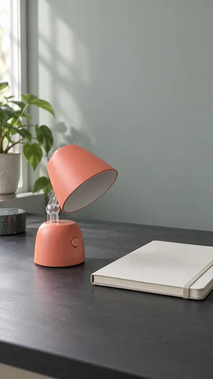](assets/flyne/fy-001-lamp.png) | [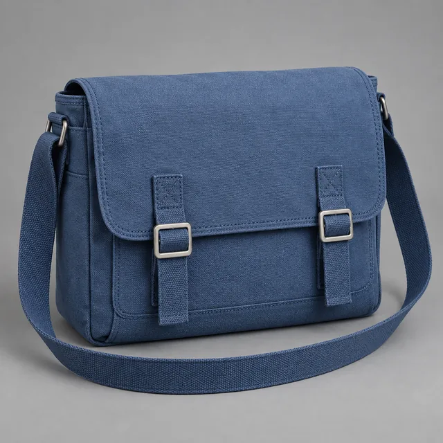](assets/flyne/fy-002-bag.png) | [](assets/flyne/fy-009-backdrop.png) |

AI-generated reference stills; not H3 outputs. / AI 生成参考图，不是 H3 视频结果。[使用说明 / Usage notes](assets/flyne-reference-briefs.md)

| BRD-001 · 观测站茶饮广告 | UGC-001 · 台灯体验演示 | TRV-001 · 雨后水乡旅行 |
|---|---|---|
| [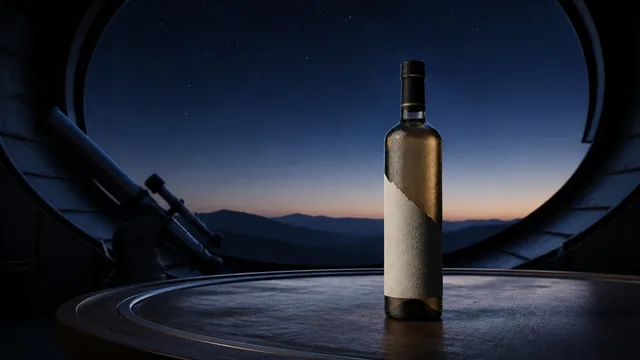](assets/gallery/midnight-observatory-tea.webp) | [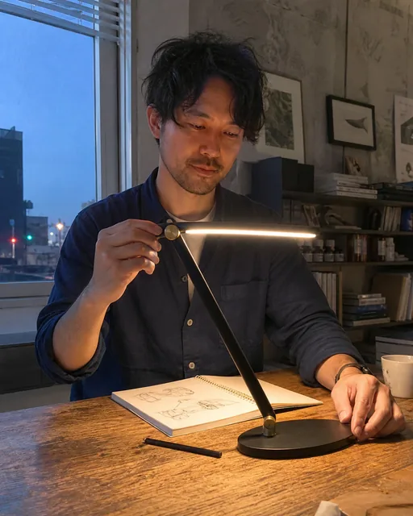](assets/gallery/honest-desk-lamp-demo.webp) | [](assets/gallery/rain-washed-canal-morning.webp) |
| [Prompt / 提示词](prompts/upstream/01-brand-advertising.md#brd-001-midnight-observatory-tea-launch) · [Image brief / 图片简报](assets/minimax-h3-reference-image-prompts.md#img-002-brand-and-product-midnight-observatory-tea) | [Prompt / 提示词](prompts/upstream/03-ugc-lifestyle.md#ugc-001-desk-lamp-honest-first-impression) · [Image brief / 图片简报](assets/minimax-h3-reference-image-prompts.md#img-003-ugc-and-lifestyle-honest-desk-lamp-demo) | [Prompt / 提示词](prompts/upstream/04-travel-hospitality.md#trv-001-rain-washed-canal-town-morning) · [Image brief / 图片简报](assets/minimax-h3-reference-image-prompts.md#img-004-travel-rain-washed-canal-morning) |

| ANI-002 · 黏土维修机器人 | ACT-001 · 室内攀岩动作 | MRF-002 · 便携音箱运镜 |
|---|---|---|
| [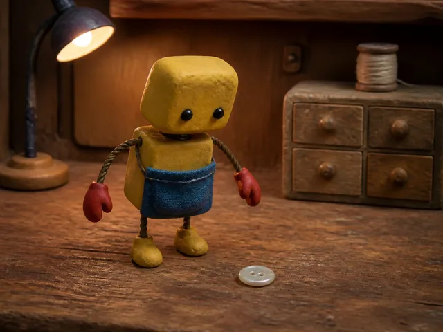](assets/gallery/clay-repair-robot.webp) | [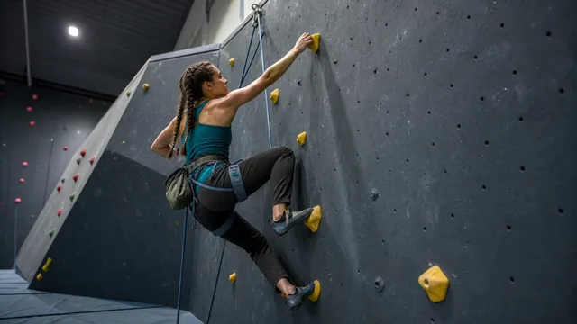](assets/gallery/indoor-climbing-final-hold.webp) | [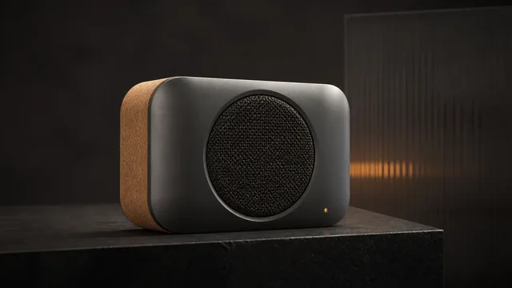](assets/gallery/radial-cork-speaker.webp) |
| [Prompt / 提示词](prompts/upstream/08-animation-stylized.md#ani-002-clay-repair-robot-finds-a-button) · [Image brief / 图片简报](assets/minimax-h3-reference-image-prompts.md#img-005-animation-clay-repair-robot-workshop) | [Prompt / 提示词](prompts/upstream/09-action-sports.md#act-001-indoor-climbing-final-move) · [Image brief / 图片简报](assets/minimax-h3-reference-image-prompts.md#img-006-sports-indoor-climbing-final-hold) | [Prompt / 提示词](prompts/upstream/20-multireference-camera-transfer.md#mrf-002-radial-cork-speaker-transfer-motion-grammar-not-content) · [Image brief / 图片简报](assets/minimax-h3-reference-image-prompts.md#img-007-product-radial-cork-speaker) |

| CHR-001 · 纸艺角色对白 | MRF-001 · 微缩博物馆长镜头 | MOG-001 · 夜市动态海报 |
|---|---|---|
| [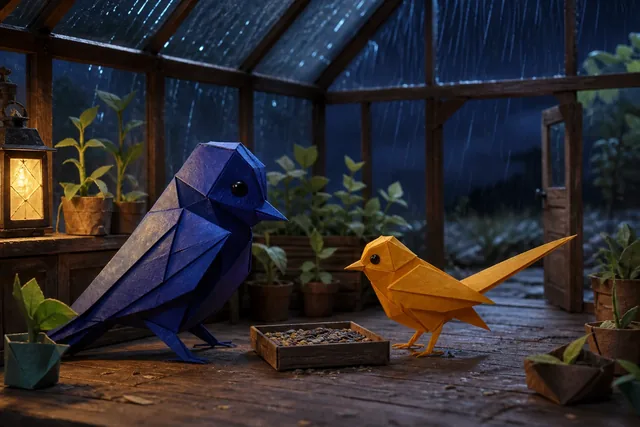](assets/gallery/paper-birds-storm-shelter.webp) | [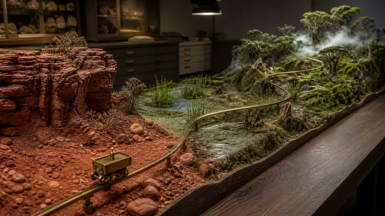](assets/gallery/three-biome-museum-rail.webp) | [](assets/gallery/dynamic-night-market-poster.webp) |
| [Prompt / 提示词](prompts/upstream/21-character-dialogue-performance.md#chr-001-paper-birds-plan-for-the-storm) · [Image brief / 图片简报](assets/minimax-h3-reference-image-prompts.md#img-008-character-paper-birds-in-a-storm-shelter) | [Prompt / 提示词](prompts/upstream/20-multireference-camera-transfer.md#mrf-001-three-biome-museum-rail-in-one-take) · [Image brief / 图片简报](assets/minimax-h3-reference-image-prompts.md#img-009-multi-reference-three-biome-museum-rail) | [Prompt / 提示词](prompts/upstream/22-motion-graphics-dynamic-posters.md#mog-001-night-market-poster-builds-on-the-beat) · [Image brief / 图片简报](assets/minimax-h3-reference-image-prompts.md#img-010-motion-graphics-dynamic-night-market-poster) |

| SRL-001 · 地图变成微缩地形 | VER-001 · 模块化午餐罐演示 |
|---|---|
| [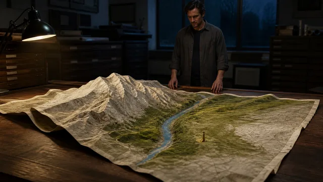](assets/gallery/topographic-map-archive.webp) | [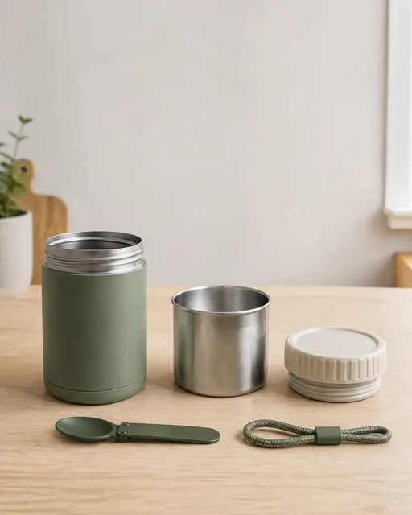](assets/gallery/modular-lunch-jar-kit.webp) |
| [Prompt / 提示词](prompts/upstream/23-surreal-physics-optical-illusions.md#srl-001-the-map-rises-into-a-landscape) · [Image brief / 图片简报](assets/minimax-h3-reference-image-prompts.md#img-011-surreal-physics-topographic-map-archive) | [Prompt / 提示词](prompts/upstream/24-vertical-series-live-creator.md#ver-001-honest-modular-lunch-jar-live-demo) · [Image brief / 图片简报](assets/minimax-h3-reference-image-prompts.md#img-012-live-creator-modular-lunch-jar-kit) |


[全部参考图及使用说明 / All reference images and usage notes](docs/reference-gallery.md)

## 按使用场景选择

| 交付目标 | 推荐入口 | 核心验收点 |
|---|---|---|
| 广告、品牌、信息流开头 | [品牌库](prompts/upstream/01-brand-advertising.md)、[静音功能展示](prompts/flyne/fy-001.md) | 动作清楚、宣传主张真实 |
| 电商 SKU、商品配色 | [商品库](prompts/upstream/02-product-ecommerce.md)、[配色对比](prompts/flyne/fy-002.md) | 外形、材质、五金件一致 |
| 客服与员工培训 | [卡扣演示](prompts/flyne/fy-003.md)、[仓储异常](prompts/flyne/fy-010.md) | 专业人员确认操作准确 |
| SaaS 产品引导 | [UI 库](prompts/upstream/11-ui-game-digital.md)、[空状态引导](prompts/flyne/fy-005.md) | 界面状态与真实产品一致 |
| 双语服务、角色对话 | [对话库](prompts/upstream/21-character-dialogue-performance.md)、[双语欢迎](prompts/flyne/fy-006.md) | 语义、口型、人物稳定 |
| 互动叙事与拍摄预演 | [博物馆分支](prompts/flyne/fy-007.md)、[天气备选](prompts/flyne/fy-015.md) | 分支方向与镜头衔接 |
| 包装、活动与视觉设计 | [包装预演](prompts/flyne/fy-008.md)、[字幕背景](prompts/flyne/fy-009.md) | 可实现性与可读性 |
| 局部编辑与模型测试 | [季节橱窗](prompts/flyne/fy-012.md)、[参考角色测试](prompts/flyne/fy-016.md) | 不改动指定区域之外的内容 |

引入库还覆盖旅游、餐饮、时尚、电影、动画、运动、特效、音乐、教育、建筑、交通、宠物、工业与竖屏短剧。[完整目录](prompts/README.md) · [使用条件](docs/recipe-usage.md)。

## 全部 24 类提示词

以下分类保留源库的 84 条配方；上面的用途表补充 Flyne 的实际场景。按自己要做的内容进入，无需先搜索编号。

| 分类 | 数量 | 典型用途 |
|---|---:|---|
| [品牌广告](prompts/upstream/01-brand-advertising.md) | 3 | 产品发布、门店活动、跨画幅广告 |
| [商品电商](prompts/upstream/02-product-ecommerce.md) | 3 | 商品细节、材质展示、旋转展示 |
| [生活分享](prompts/upstream/03-ugc-lifestyle.md) | 3 | 开箱体验、日常使用、收纳测试 |
| [旅行住宿](prompts/upstream/04-travel-hospitality.md) | 3 | 目的地介绍、住宿展示、市场漫游 |
| [餐饮饮品](prompts/upstream/05-food-beverage.md) | 3 | 制作过程、上菜镜头、食物质感 |
| [时尚美妆](prompts/upstream/06-fashion-beauty.md) | 3 | 服装展示、妆容特写、造型切换 |
| [电影叙事](prompts/upstream/07-cinematic-storytelling.md) | 3 | 人物情绪、悬疑片段、故事转折 |
| [风格动画](prompts/upstream/08-animation-stylized.md) | 3 | 纸艺、黏土角色、水墨场景 |
| [动作运动](prompts/upstream/09-action-sports.md) | 3 | 攀岩、自行车、球类动作 |
| [幻想与特效](prompts/upstream/10-fantasy-scifi-vfx.md) | 3 | 物体变化、幻想场景、视觉特效 |
| [界面与游戏](prompts/upstream/11-ui-game-digital.md) | 3 | 软件引导、设备界面、游戏操作 |
| [转场与喜剧](prompts/upstream/12-transitions-comedy-social.md) | 3 | 匹配剪辑、视觉笑点、循环短片 |
| [音乐与表演](prompts/upstream/13-music-performance-audio.md) | 4 | 演唱、舞蹈、音乐节奏可视化 |
| [教育与科普](prompts/upstream/14-education-documentary-science.md) | 4 | 科学解释、博物馆介绍、操作教学 |
| [建筑与室内](prompts/upstream/15-architecture-interiors-real-estate.md) | 4 | 房屋参观、光照变化、装修预演 |
| [交通与出行](prompts/upstream/16-automotive-mobility.md) | 4 | 汽车内饰、自行车、列车体验 |
| [自然与宠物](prompts/upstream/17-nature-animals-pets.md) | 4 | 野生动物、宠物用品、植物观察 |
| [工业与公共服务](prompts/upstream/18-industry-business-public-service.md) | 4 | 生产流程、物流、疏散与服务说明 |
| [视频编辑与延续](prompts/upstream/19-editing-continuation-localization.md) | 4 | 背景清理、续拍、语言适配、重新打光 |
| [多参考与运镜](prompts/upstream/20-multireference-camera-transfer.md) | 4 | 一镜到底、镜头运动迁移、动作衔接 |
| [角色与对话](prompts/upstream/21-character-dialogue-performance.md) | 4 | 人物表演、双语对话、多人场景 |
| [动态图形与海报](prompts/upstream/22-motion-graphics-dynamic-posters.md) | 4 | 海报组装、功能卡片、展览片头 |
| [超现实与错觉](prompts/upstream/23-surreal-physics-optical-illusions.md) | 4 | 材质变化、时间错位、空间错觉 |
| [竖屏连载与直播](prompts/upstream/24-vertical-series-live-creator.md) | 4 | 产品演示、短剧、维修连载、问答 |

## 先分清 H3 与 H3 Max

截至 **2026-09-17**，官方 H3-Base 提供 FL2VA、Ref2VA 开放权重；H3 Max 是 fal 基于 H3 后训练的托管版本，本次核验未发现其公共权重。官方完整 2K 流程还包含托管组件。详见[模型指南及官方来源](docs/model-guide.md)。

因此，“H3 开放权重”不等于“Max 已经开源”，也不等于完整产品链路都能离线运行。本仓库 MIT 许可不覆盖模型权重；部署及商用需核对 H3 Community License 与对应服务条款。

## 官方资源与下载

- [MiniMax H3 官方仓库](https://github.com/MiniMax-AI/MiniMax-H3)：发布说明、运行代码与请求示例。
- [模型卡与权重下载](https://huggingface.co/MiniMaxAI/MiniMax-H3)：查看模型许可、版本与运行要求。
- [官方能力与提示词示例](https://platform.minimaxi.com/docs/guides/video-prompt)：查看创作方式与示例。
- [官方视频生成文档](https://platform.minimaxi.com/docs/guides/video-generation)：核对接口模式与请求字段。
- [本地部署指南](docs/deployment-guide.md) · [接口接入说明](docs/api-workflow.md) · [官方请求脚本和视频对照](docs/official-h3-examples.md)。

## 让提示词变成可持续工作流

- [浏览器、本地和托管路线](docs/workflows.md)：选模式、分配素材角色、串联多镜头。
- [质量与成本评估](docs/evaluation.md)：合格率、每条可用视频成本、失败原因。
- [后续价值与研究方向](docs/opportunities.md)：产品参考库、本地化、定制、加速与互动原型。
- [来源与待核验事项](docs/sources.md)：记录官方链接、核验日期和事实边界。
- [维护路线图](ROADMAP.md)：优先补实测、兼容性与翻译，而非空泛增加数量。

开放权重的价值在于可评估、可适配与可探索的工程空间。是否值得投入，需要实际合格率、维护负担与成本验证；本文不承诺模型未来版本或商业收益。

## 离线检索与项目维护

需要 Python 3.9+，无需额外依赖或 API key。

```sh
python3 scripts/catalog.py search "product"
python3 scripts/catalog.py search "FX5-002" --origin exercise --show-prompt
python3 scripts/catalog.py search "客服" --origin flyne --show-prompt
python3 scripts/build.py
python3 scripts/validate.py
```

搜索覆盖 100 条配方和另列的 12 条五秒练习。`--origin exercise` 只查练习，`--show-prompt` 显示中英文提示词；练习尚未实测，与社区视频的作者原文分开。

[结构化目录](data/catalog.json)可用于后续网站或工具。校验脚本检查数量、唯一 ID、站内链接、8 种语言入口及引入内容一致性，不执行模型推理。README 支持英、中、日、韩、西、法、德、葡；详细指南主要为英文，部分提供中文或多语言章节，提示词正文以英文为准。

## Flyne AI、来源与贡献

[Flyne AI](https://flyne.ai/) 是本项目品牌及浏览器体验入口。实际额度、费用、模式和可用性以产品页面为准，不承诺永久免费，也不声称 Flyne 已提供 H3 Max 接口。

84 条引入提示词保留 **Flaq AI** 原始署名、固定版本来源和完整 MIT 许可证；没有通过改几个词将其冒充原创。新增指南、16 条新场景及工具独立标注。[第三方声明](THIRD_PARTY_NOTICES.md)。

欢迎提交真实运行记录、新场景、翻译修正与官方资料更新。参见[贡献指南](CONTRIBUTING.md)、[提示词模板](templates/prompt.md)和[行为准则](CODE_OF_CONDUCT.md)。

Flyne 新增内容采用 [MIT](LICENSE)，引入内容保留[上游 MIT](licenses/Flaq-AI-MIT.txt)。项目不代表 MiniMax 官方，产品名称属于各自权利人。

## 欢迎成为 Flyne AI 联盟合作伙伴

欢迎内容创作者、教育者、工具评测者和创意团队成为我们的合作伙伴！通过专属推荐链接分享 Flyne AI，即可按规则获得有效付费订单的推广佣金：

- 推荐用户的首笔有效付费订单：**20% 佣金**。
- 该用户注册后 **60 天内**的后续有效付费订单：**10% 佣金**。

[了解并加入 Flyne AI 联盟计划](https://flyne.ai/affiliate-program/)。订单资格、归因及佣金结算以当前联盟协议和审核结果为准。

如有问题或合作意向，欢迎联系：[contact@flyne.ai](mailto:contact@flyne.ai)。
