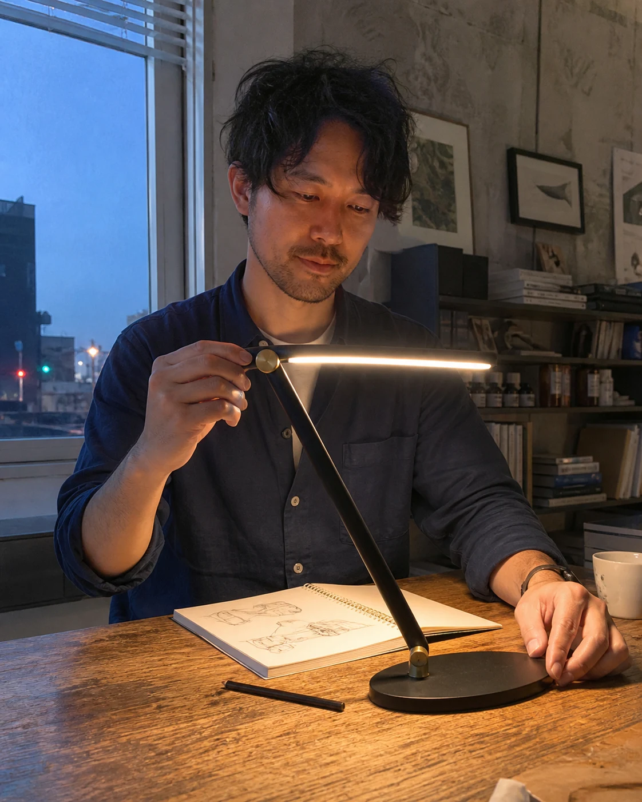
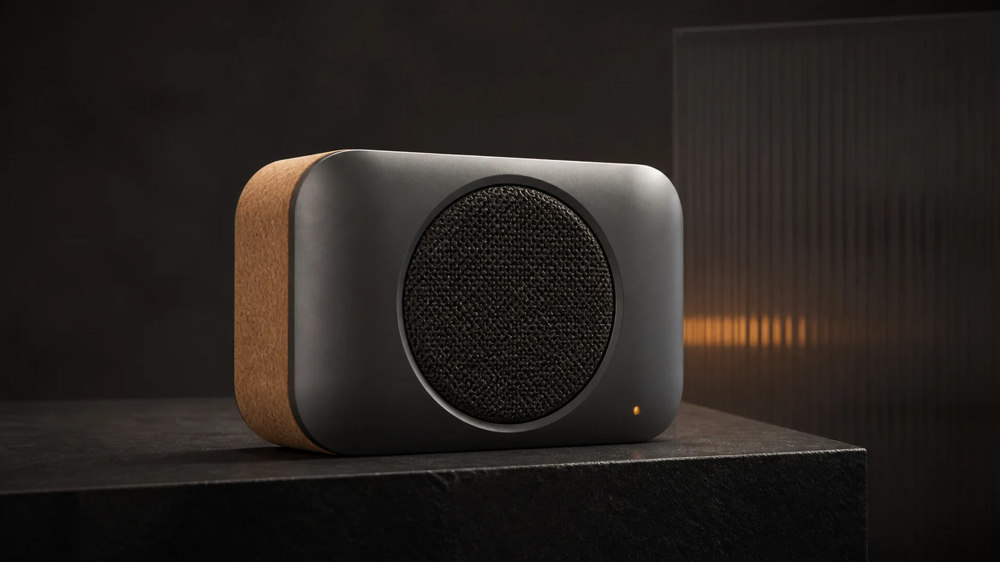
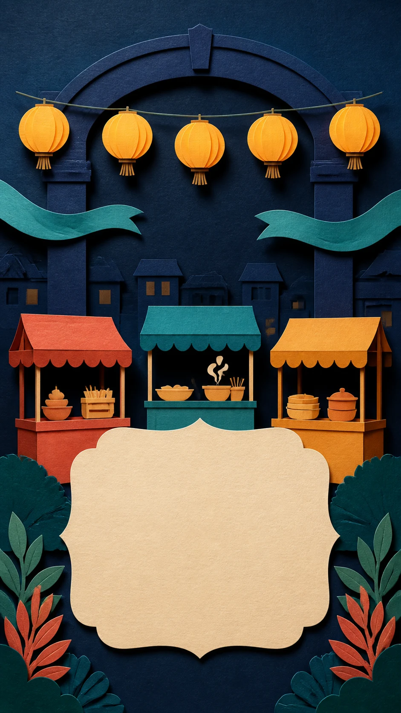
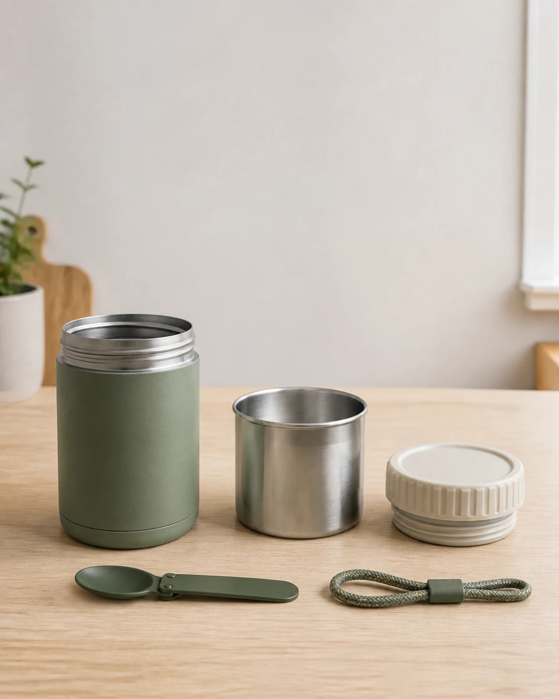

# Flyne AI 参考图目录 / Reference gallery

图片库包含 3 张 FlyneAI 新增参考图、11 张引入场景图和 FlyneAI 封面。下方 Flaq AI 章节的场景图引入自其 MIT 授权素材，原图没有公司品牌标志；这里保留图像内容和作者署名，按场景接入 FlyneAI 指南。它们是图像生成工具制作的参考素材，不是 MiniMax H3 视频成片，也没有改署为 Flyne 原创。

[先做 5 秒视频](quick-start.md) · [100 条配方](../prompts/README.md) · [来源与许可](../THIRD_PARTY_NOTICES.md)

**如何使用：** 点击图片查看完整文件，再打开对应配方和图片制作说明。只使用当前工具支持的输入。免费入口使用图片引导时需要首尾两张，单独一张参考图并不构成完整输入；可以先使用纯文字练习。

These attributed reference images are unchanged MIT-licensed imports. The Flyne cover is separate. They are not H3 outputs. Follow the linked recipe and brief; a single image does not satisfy the free tool’s two-frame input requirement.

## Flyne AI 新增参考图 / New illustrations

### FY-001

构图参考；原配方为纯文字，不必上传此图。图中笔记本是合上的；需要页面被照亮时应在实际生成中检查。 / Composition reference only; the recipe needs no image. The notebook is closed in this illustration; check the illuminated page in actual generation.

### FY-002

可作为 Image 1 的虚构包款参考；仍需自备蓝色与赭色色卡。不是完整输入包，也不是生成视频。 / Fictional bag identity reference for Image 1; supply separate approved blue and ochre swatches. Not a complete input pack or a generated video.

### FY-009

仅展示留白构图；原配方为纯文字，不必上传。字幕需后期添加；实际可读性仍需检查。 / Composition reference only; no upload required. Add captions in editing and check readability.

[完整图片提示词与来源 / Image prompts](../assets/flyne-reference-briefs.md)

## Flaq AI 引入参考图 / Attributed stills

## midnight-observatory-tea

[BRD-001](../prompts/upstream/01-brand-advertising.md#brd-001-midnight-observatory-tea-launch) · [IMG-002](../assets/minimax-h3-reference-image-prompts.md#img-002-brand-and-product-midnight-observatory-tea)

## honest-desk-lamp-demo

[UGC-001](../prompts/upstream/03-ugc-lifestyle.md#ugc-001-desk-lamp-honest-first-impression) · [IMG-003](../assets/minimax-h3-reference-image-prompts.md#img-003-ugc-and-lifestyle-honest-desk-lamp-demo)

## rain-washed-canal-morning

[TRV-001](../prompts/upstream/04-travel-hospitality.md#trv-001-rain-washed-canal-town-morning) · [IMG-004](../assets/minimax-h3-reference-image-prompts.md#img-004-travel-rain-washed-canal-morning)

## clay-repair-robot

[ANI-002](../prompts/upstream/08-animation-stylized.md#ani-002-clay-repair-robot-finds-a-button) · [IMG-005](../assets/minimax-h3-reference-image-prompts.md#img-005-animation-clay-repair-robot-workshop)

## indoor-climbing-final-hold

[ACT-001](../prompts/upstream/09-action-sports.md#act-001-indoor-climbing-final-move) · [IMG-006](../assets/minimax-h3-reference-image-prompts.md#img-006-sports-indoor-climbing-final-hold)

## radial-cork-speaker

[MRF-002](../prompts/upstream/20-multireference-camera-transfer.md#mrf-002-radial-cork-speaker-transfer-motion-grammar-not-content) · [IMG-007](../assets/minimax-h3-reference-image-prompts.md#img-007-product-radial-cork-speaker)

## paper-birds-storm-shelter

[CHR-001](../prompts/upstream/21-character-dialogue-performance.md#chr-001-paper-birds-plan-for-the-storm) · [IMG-008](../assets/minimax-h3-reference-image-prompts.md#img-008-character-paper-birds-in-a-storm-shelter)

## three-biome-museum-rail

[MRF-001](../prompts/upstream/20-multireference-camera-transfer.md#mrf-001-three-biome-museum-rail-in-one-take) · [IMG-009](../assets/minimax-h3-reference-image-prompts.md#img-009-multi-reference-three-biome-museum-rail)

## dynamic-night-market-poster

[MOG-001](../prompts/upstream/22-motion-graphics-dynamic-posters.md#mog-001-night-market-poster-builds-on-the-beat) · [IMG-010](../assets/minimax-h3-reference-image-prompts.md#img-010-motion-graphics-dynamic-night-market-poster)

## topographic-map-archive

[SRL-001](../prompts/upstream/23-surreal-physics-optical-illusions.md#srl-001-the-map-rises-into-a-landscape) · [IMG-011](../assets/minimax-h3-reference-image-prompts.md#img-011-surreal-physics-topographic-map-archive)

## modular-lunch-jar-kit

[VER-001](../prompts/upstream/24-vertical-series-live-creator.md#ver-001-honest-modular-lunch-jar-live-demo) · [IMG-012](../assets/minimax-h3-reference-image-prompts.md#img-012-live-creator-modular-lunch-jar-kit)

